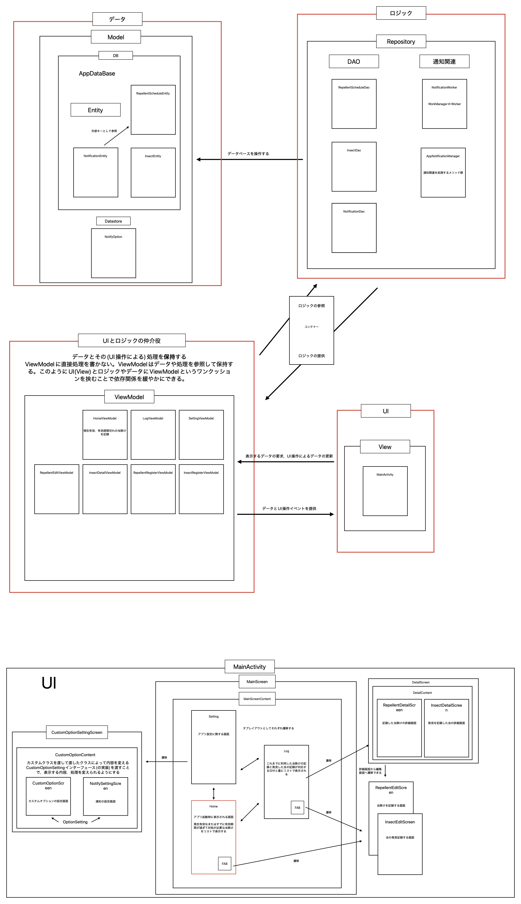
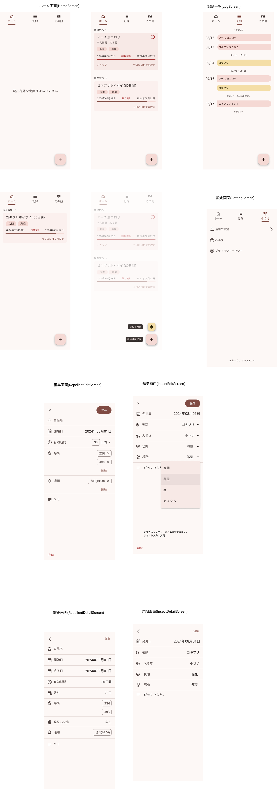

> [!CAUTION]
> ### 開発中

アプリの機能：害虫忌避剤の使用を記録して，効果が切れる頃に通知を送ることで安心できるアプリ。

ポイント：

1. 前回の開発[AlarmByNotification](https://github.com/LJPB/AlarmByNotification)は設計をせずに作ったため，コードの修正が困難だった。今回は，その反省を踏まえてアプリの大まかな構造を事前に考えておいた。

問題点：

1. 技術に対する理解不足により，構造の変更が多々ある
2. 設計に関してUMLなどの一般的な記法/手法を使っていない
3. 開発中の変更点を設計図に反映していない
4. gitのcommitのルール(粒度，メッセージ等)を決めていないため，バージョン管理ができていない

よかった点：

1. 一つのクラス/ファイルに機能を詰め込みすぎないこと，依存関係がわかりやすいことを意識したおかげで，変更時の他コードへの影響範囲の把握が容易だった

### 概観

### UI

